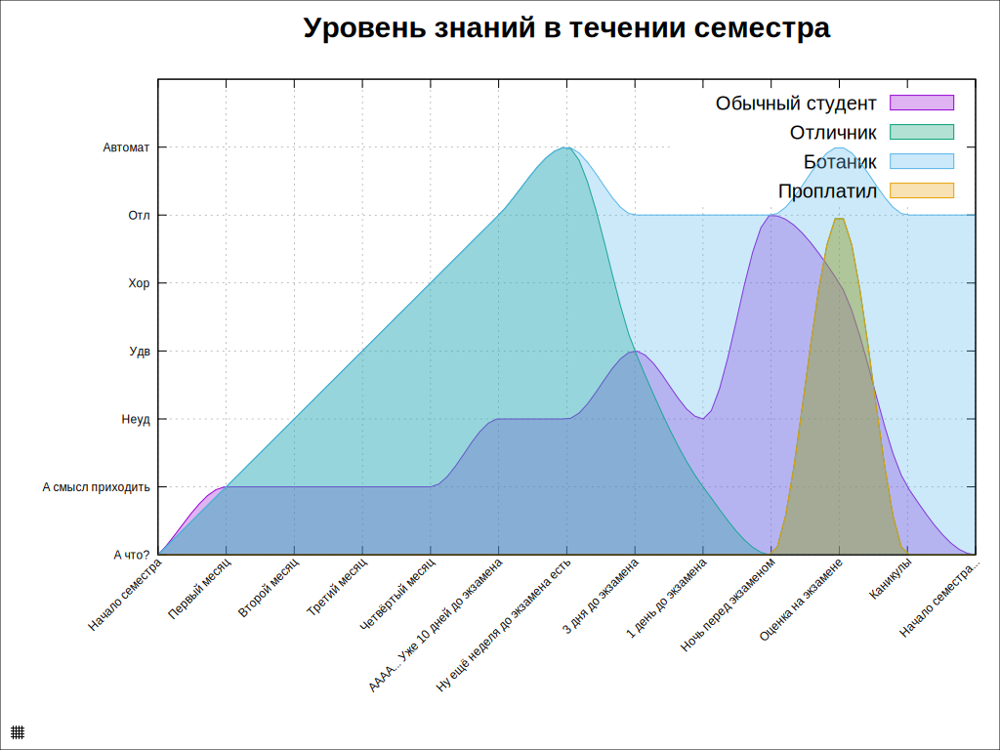

# Обновление svg-файла, чтобы все скрипты и картинки были в нём.

Простейший пример, как можно преобразовать выходной svg-файл гнуплота, так чтобы его содержимое было в одном файле, а не размазано по куче скриптов.

Пример результата
